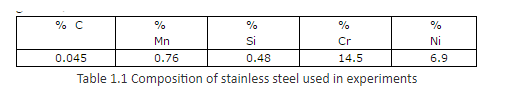
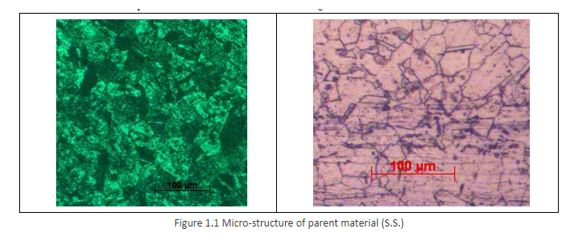
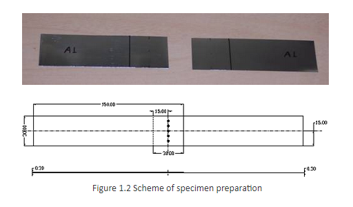
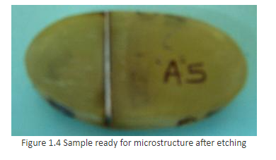
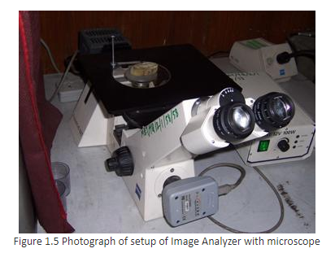

### Experimental setup

The schematic diagram of laser system along with 3-axis gantry used during experimentation is as shown in the Fig 1.2 is the actual photograph of the system.

The specifications of the laser head and 3-axis gantry attached with the system are as below.

* Laser head specifications
* Laser type - Pulsed Nd: YAG
* Wavelength - 1.06&mu;m
* Maximum average output power - 200 watts
* Pulse repetition rate - 1&#126;200Hz
* Maximum power per pulse @20msec pulse width - 80Joules
* Pulse width - 100&mu;sec to 20msec
* Beam divergence – 20mrad
* Maximum Beam diameter - 8mm
* Beam expander - 2X to 8X with input aperture of maximum 20mm
* Power supply - 3 phase 440 V AC mains input power supply with 32 Amp of current
* Pulse shaping - increasing and decreasing steps for welding
* 3 - axis gantry specifications
* Multi - Axis CNC motion systems
* Model: SLP - CNC1824SS
* Table Area: - X = 200, Y = 200, Z = 50 & with &theta; (Rotary axis)
* All axes precision pre loaded ball screws.
* Resolution: - 2 microns
* Motors: Micro stepping motors 2 phase.
* Micro stepping motor with gearbox, on all axeshe schematic

### Procedure
**1.0 Material for experimentation**

The stainless steel plates of 0.3mm thickness are used for the experimentation. The chemical analysis was carried out and, the composition obtained is as given in, Table 1.1 below.

The micro-structure of the parent material is as shown below in Figure 1.1.

**1.1 Preparation of test specimens**

The material used for experimentation is stainless steel plate of thickness 0.3mm, as shown in Figure 1.2. The test specimens prepared are of size 150 X 30mm.

The samples are produced from 0.3mm thick stainless steel using the press machine by shearing; to overcome the problems regarding edge quality. The reason is to avoid the inconvenience of holding the sample in fixture before welding and during the shear tension test on an electronic tensometer.
The samples are cleaned using acetone; an effective means for sample preparation for materials sensitive to residue and moisture. The lap joint is prepared with 30mm overlapping and holding in a fixture, which minimizes the air gap at the overlap. The fixture maintains the relative position of the weldments samples while providing beam access to the sample. The fixture should be adequately robust, and distortion should be avoided. The Figure 1.3 below shows a photograph of the sample mounted in fixture.

**1.2 Post- experimental specimen preparation**

After the laser spot welding, the sample is grounded by using different grades of emery papers (200, 400, 600, and 800). Then specimens are polished by using different grades of polishing papers (1/0, 2/0, 3/0, 4/0, and 5/0) followed by lapping and polishing machine. After polishing the surface is thoroughly washed with soap solution and dried with a hot drier.
For the purpose of metallographic analysis, the treated specimens were transversely cut on CNC Wire EDM. The samples are cold mounted and lapping process is completed. Subsequently the surface is etched, to observe the microstructure on Image Analyzer with microscope (shown in Figure 1.5), the recommended enchant Vilella’s reagent (5cc HCL +100cc Ethanol + 1 gm picric acid) solution is used. This made the specimens ready for the study of microstructure as shown in Figure 1.4.

**1.3 Metallographic analysis**

The microstructure of the laser treated specimen is as shown in Figure 1.6. The case depth and width of the spot are measured by using image analyzer with microscope.

It is assumed that the maximum depth and width of the spot are available at centre of the spot. Therefore, to ensure the same successive polishing of the specimen is carried out to remove the minimum possible material.

**1.4 Weld strength tests**

Sample used for Weld strength (tensile strength) test had the shape and dimensions as shown in Figure 1.7 above, the tensile strength is referred as weld strength in the next all chapters. The tensile strength test was carried out by using Electronic Tensometer Tester with a test speed of 0.2mm/min, experiment run, with a higher limit 2000N and minimum 20N.

**1.4 Experimentation**
Number of spots are considered with different power (interaction time) and beam spot size to identify the appropriate range.

**1.4.1 Spots of different beam power at constant beam spot size**
The various spots are taken on samples for constant beam spot size 0.85mm within the power range of 486 to 642 Watts.

**1.4.2 Spots of different beam diameter at constant beam power**
The various spot welded samples are taken for constant beam power 607W for beam spot size ranging from 0.68 to 0.96mm.
